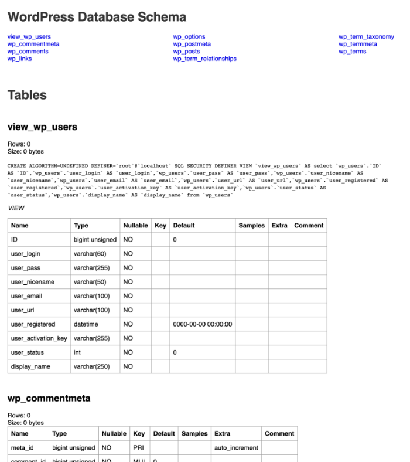

# database-documentor-yaml

This is an OpenAPI-like tool to automate making database schema documentation. Like OpenAPI, it
uses YAML files to store the structure - and your human-readable notes. Use the included document
builder to generate a self-contained HTML file with your documentation.

Unlike OpenAPI, the included database scanner jumpstarts your documentation by getting most
of the information from the database and leaving blank fields if you want to fill in more detail



## Features
- Most of the work is automated with very little setup
- Human and machine-readable files can be managed in your regular source control
- Links between tables with foreign keys 
- Links between tables and their triggers
- (Optionally) shows a sample of each fields' contents
- Quickly find which table a particular field is in
- Easy to style HTML template. Fork it

## Quickstart

From a typically-equipped PHP environment:
- `composer install`
- Copy `config.ini.example` to `config.ini` and update with a read-only database user
- Scan your database to create a YAML file using `php database_scanner.php`
- Compile the YAML file to HTML documentation with `php html_doc_builder.php`
- Enjoy the file: `schema.html`

Need an environment? No problem, a Docker container is included.

```
docker build -t r11g:databaes-documentor .
docker run -it --mount type=bind,src=$(pwd),dst=/database-documentor  r11g:database-documentor /bin/bash
cd database-documentor
composer install
cp config.ini.example config.ini
nano config.ini
php database_scanner.php
php html_doc_builder.php 
# Enjoy the schema.html document!
```


